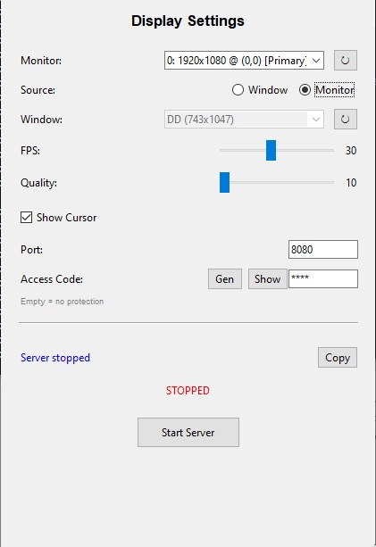
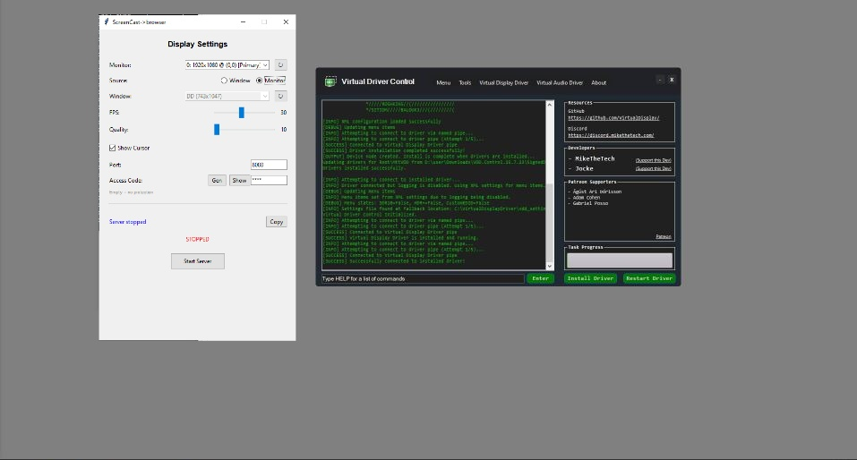
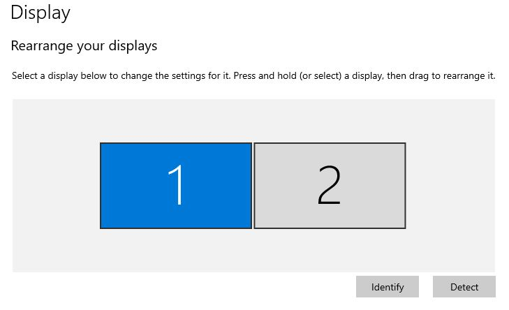

# ScreenCast->browser

ScreenCast 2 browser — stream desktop or a single app window to any device browser on the same network, no install needed. Captures fullscreen via DXGI (dxcam) or one window via Windows Graphics Capture (windows-capture) and streams MJPEG via Flask, with monitor/window selection, FPS/quality control, access code protection and auto-reconnect on disconnect.



## Run

```bat
pip install -r requirements.txt
python main.py
```

Open `http://IP:PORT/?code=1234` (default code `1234`, or click **Gen** for random)



## Features

- **Monitor selection** with live Win32 detection + dxcam fallback, dynamic offset (no hardcoded 1920) — see [Monitor capture](#monitor-capture)
- **Window capture** (WGC): stream a single app window, isolated even when covered by other windows; minimizing/closing freezes the last frame until the window returns — see [Window capture](#window-capture)
- **FPS/Quality** slider with perf_counter-based timing (no extra frame copy)
- **Access code** protection: `secrets.compare_digest`, header `X-Access-Code` support, 10/min rate-limit (429)
- **Single-viewer by default**: `MAX_CLIENTS = 1` in `server.py` — extra viewers get `429 Server busy` and retry silently
- **Streaming resilience**: producer/consumer (latest-only, drop-late), `/status` heartbeat (`frame_id` + generation), backoff reconnect, `visibilitychange` probe
- **Thread-safe**: `RLock` + `Event` for camera/server, port busy pre-check via `SO_REUSEADDR=0`
- **Structured code** (Phase 3): `gui.App` class, `StreamConfig` TypedDict, `logging` instead of silent `except: pass`

## Monitor capture

Stream a full display via DXGI Desktop Duplication (`dxcam`, logic in `monitor.py` + `capture.py`):

1. Set **Source** to **Monitor** (server must be stopped).
2. Press **↻** next to the Monitor list to refresh, pick the display, then **Start Server**.
3. Open the link in any browser — same URL/auth/heartbeat as window mode.

Behavior:

- **Live detection**: displays are enumerated via Win32 on every refresh, with dxcam probing as fallback — no restart, no hardcoded offsets (multi-monitor layouts, including negative coordinates, work).
- **Cursor**: green crosshair overlay drawn onto the frame (toggle with Show Cursor).
- **FPS/Quality** sliders apply live while streaming.
- Switching source or refreshing the list requires stopping the server first.

### Extend display to any browser device

Use https://github.com/VirtualDrivers/Virtual-Display-Driver to create a virtual monitor, then select it in ScreenCast->browser to extend your desktop to any device with a web browser (phone, tablet, TV).



## Window capture

Stream one app window instead of the whole screen (Windows Graphics Capture via `windows-capture`, isolated in `window.py` + `window_capture.py`):

1. Set **Source** to **Window** (server must be stopped).
2. Press **↻** next to the Window list to refresh, pick the window, then **Start Server**.
3. Open the link in any browser — same URL/auth/heartbeat as monitor mode.

Behavior:

- The window picture is **isolated**: overlapping windows on your desktop do not leak into the stream.
- **Minimize / close**: the browser keeps (freezes) the last frame; streaming resumes automatically when the window is back. No restart needed.
- **Resize / move**: picked up live, no restart needed.
- **Cursor**: drawn natively by WGC in window mode (the green crosshair overlay applies to monitor mode only).
- Limits (WGC itself): elevated-admin windows and some UWP/store windows may refuse capture; switching source or refreshing the list requires stopping the server first.

## Build EXE

```bat
build.bat
```

Output: `dist/ScreenCast-browser.exe` (~77MB, PyInstaller 6.22.2, no redundant add-data)

`ScreenCast-browser.spec` uses `collect_all` only - py files auto-discovered via imports.

## Structure

- `main.py` - entry + logging setup
- `config.py` - `StreamConfig` TypedDict, `lock`/`stop_event`/`server_lock`, `generate_access_code()`
- `monitor.py` - `get_ip()`, `get_available_monitors()`, `get_monitor_offset()` (dynamic), `init_monitors()`
- `window.py` - `get_available_windows()`, `cache_windows()`, `is_window_valid/minimized()` (isolated)
- `window_capture.py` - `WindowCaptureSession` (WGC via windows-capture, latest-only queue)
- `capture.py` - `generate()` (perf_counter, yield multipart) + window/monitor branch
- `server.py` - Flask `app`, `is_authorized()`, `run_server()`, `MAX_CLIENTS`, `/status` heartbeat
- `gui.py` - `class App(tk.Tk)` (Phase 3), `create_gui()` factory

## Security

- Default `1234` for demo; use **Gen** to create `8-char` `A-Z/2-9` code (`secrets`)
- Code can be sent via `?code=` or header `X-Access-Code` (avoids URL logging)
- Rate-limit: 429 after 10 failed attempts per 60s per IP

## Settings

GUI (no restart needed, applies live):

- **Source** — Monitor (full screen via DXGI/dxcam) or Window (single app via WGC)
- **Monitor** — display to stream (refresh with ↻ while stopped)
- **Window** — app window to stream (refresh with ↻ while stopped, pick before Start)
- **FPS** — 5–60, default `30`
- **Quality** — JPEG 10–95, default `70` (lower = less bandwidth)
- **Show Cursor** — green crosshair overlay (monitor mode) / native cursor (window mode), default on
- **Port** — default `8080`
- **Access Code** — default `1234`, empty = no protection

Source details: [Monitor capture](#monitor-capture) · [Window capture](#window-capture).
Switching source requires stopping the server first.

Code-only (`server.py:18-22`, edit + restart):

```python
_RATE_LIMIT_MAX: int = 10    # failed logins before 429
_RATE_LIMIT_WINDOW: int = 60  # seconds
MAX_CLIENTS: int = 1          # concurrent /video viewers (0 = unlimited)
```

Notes: only `/video` streams count toward `MAX_CLIENTS` (`/` and `/status` are free); a rejected viewer gets `429 Server busy` and its browser keeps the last frame while retrying silently with backoff. One browser tab = one slot — close duplicate tabs if you hit the limit during reconnect overlap.

## Logging

```bat
python main.py 2> app.log
```

Levels: `INFO` for start/stop, `DEBUG` for frame/cursor details.

## Requirements (pinned)

```
dxcam==0.3.0
Flask==3.1.3
Werkzeug==3.1.8
pywin32==312
numpy==2.4.6
comtypes==1.4.16
Pillow==12.3.0
simplejpeg==1.9.0
windows-capture==2.0.1
```

## License

MIT — see [LICENSE](LICENSE).
